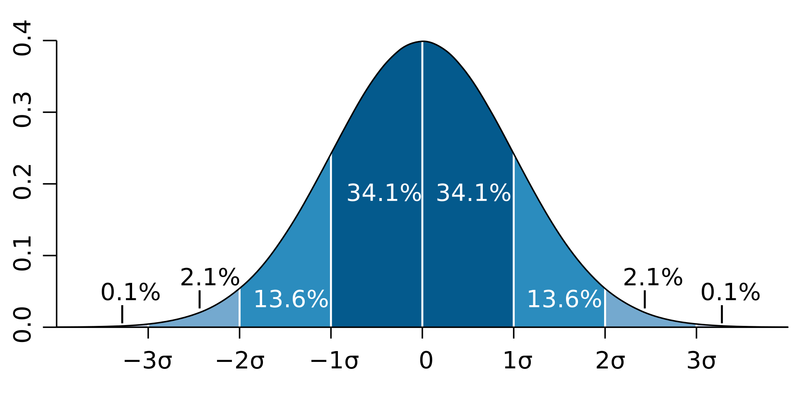

# Week 4: APIs for Data Preparation

## Weekly Learning Outcomes

> - Identify mathematical terms and techniques associated with the preparation and analysis of data (MLO 1)
> - Articulate the advantages and disadvantages of using constructs from the NumPy and Pandas’ API within specific contexts (MLO 3)
> - Select and apply appropriate NumPy and Pandas’ data structures and functions, to solve simple data cleaning and organisation problems (MLO 3)

<h2>Reading for this Week</h2>

Core reading from McKinney W. (2017).  Python for Data Analysis. 2nd ed. Springer. O'Reilly Media

### Required Reading

#### Lesson 1

- Chapter 20

  - Hinton, P, R. (2014) Statistics explained. London: Routledge

- Chapter 4 & 5

  - Diamond, Ian., and Jefferies, J. (2001) Beginning Statistics: An Introduction for Social Scientists. Routledge

- Chapter 12, Section 12.4

- Chapter 2 (pp. 23-41)

- Chapter 13, (pp 223-233)

  - O’Regan G. (2013) Mathematics in Computing London: Springer-Verlag

- Pages 149-184

  - Vince J. (2015) Matrices. In: Foundation Mathematics for Computer Science. Springer, Cham

#### Lesson 2

- Chapter 4

  - McKinney W. (2017).  Python for Data Analysis. 2nd ed. Springer. O'Reilly Media

#### Lesson 3

- Chapter 5

  - McKinney W. (2017).  Python for Data Analysis. 2nd ed. Springer. O'Reilly Media

#### Lesson 4

- Chapter 6, section 6.1

- Chapter 6, section 6.2

- Chapter 7, sections 7.1 and 7.2

  - McKinney W. (2017).  Python for Data Analysis. 2nd ed. Springer. O'Reilly Media

## Prelearning: Maths

So, obviously, there's some maths associated with computer science and data analysis. This is a brief revisit on some of the topics that stump me the most as someone who never took A Level Maths.

### Descriptive Statistics

This is a simple list that comprises

- Mean
- Median
- Mode
- **Variance**
- **Standard Deviation**
- Quartile
- Percentile
- Normal Distribution
- **Positive Skew**
- **Negative Skew**

And the ones that are in bold are the ones I struggle most with now.

#### Variance and Standard Deviation

When it comes to describing the spread of values in a dataset, we find it useful to figure out how values in the data deviate from the centroid function (mean, median, mode) chosen. This deviation for any value $X$ is given as $X-\mu$ where $\mu$ is the centroid value. Summating this value across the entire dataset returns 0 - the sum of all deviations from the centroid is the centroid. So then we introduce **mean absolute deviation** $\frac{\sum\mid X-\mu\mid}{N}$. This is good, but this doesn't do what the next thing does, which is to increase the weights of points further from the mean

**Variance** replaces the absolute ($\mid x\mid$) with square values. This produces values that are always positive, whilst increasing the weight of points that are further from the mean. Variance is denoted as $\frac{\sum(X-\mu)^2}{N}$. This works as a good absolute value for how spread values are - high values means more spread. However, since we are dealing with the *sum of squares*, we're using variance to compare apples and pears. To bring our value back to the same terms as the data, we take the square root of the variance to produce the **standard deviation** $\sqrt{\frac{\sum(X-\mu)^2}{N}}$.

This value, denoted by $\sigma$, can be used to tell how far from the centroid a value is. In a normal distribution, approximately 34% of the values fall within $1\sigma$ of the mean:

#### Skew

Skew does what it says on the tin. Have a look at the bell curve above. If the peak was moved to the left, we would call this **positive skew**, and if it were pulled to the right, it would be **negative skew**. Weird right?

This is because of the underlying properties of skew. Skew is a value representing how the mean of the data differs from the median (i.e. how the peak moves with respect to the median). In more general terms, it can be described with this formula:

$$\frac{\sum(x-\mu)^3}{(N-1)\cdot\sigma^3}$$

Which actually has nothing to do with the median, surely? Well, it does a little actually. Depending on what central tendency (mean, median, mode) you use, skewness is affected differently. The mean is often affected more greatly than the median (because all values are used in its calculation), so we can estimate skew by saying "the mean is greater than the median, so this is positive skew".

This is why we can also use the following formula to calculate skew:

$$\frac{3\times (mean-median)}{\sigma}$$

##### Kurtosis

Not listed above, but kurtosis is a related feature of data distributions. It uses the fourth central moment (i.e. $\mu^4$) to show how tightly distributed values are around the centroid. This results, visually speaking, in a pointy peak or a flat peak. Standard Gaussian distribution has kurtosis of 3 (**meso**kurtic), while higher values are **lepto**kurtic, and lower values are **platy**kurtic

### Matrices

I've tried to come back to matrices a few times, but lost the plot a few times in doing so $:')$.

Matrices are an algebraic concept that generalises transformations. Let's say we transform a shape such that each point $(x,y)$ is translated and scaled to $(x',y')$:

$$(x',y')=(0.5x, 0.5y + 3)$$

Okay so that's a transformation. Let's do another to produce $(x'', y'')$:

$$(x'', y'') = (x', 2y+3')$$

When combining the two with respect to x and y, we produce (simplified):

$$(x'', y'') = (0.5x, y+9)$$

If we swapped the two transformations round, however, we'd have:

$$(x'', y'') = (0.5x, 1.5y+4.5)$$

And this is the property of transformations that make them **non-commutative**.

A matrix can be created to separate the constants from variables. Take the following transformation:

$$
T_3 =
\begin{cases}
x'' = (A a + B c)x + (A b + B d)y \\
y'' = (C a + D c)x + (C b + D d)y
\end{cases}
$$

This can be represented in a matrix of form:

$$
\begin{bmatrix}
x'' \\
y''
\end{bmatrix}
=
\begin{bmatrix}
A a + B c & A b + B d \\
C a + D c & C b + D d
\end{bmatrix}
\begin{bmatrix}
x \\
y
\end{bmatrix}
$$

having extracted the variables x and y to a column vector, and left the constants A, a, B, b, C, c, D, and d in a 2x2 matrix.

This 2x2 matrix is produced by multiplying 2 prior transformations: (leaving out the variables)

$$
\begin{bmatrix}
A & B \\
C & D
\end{bmatrix}
\begin{bmatrix}
a & b \\
c & d
\end{bmatrix}
$$

Here are the rules for matrix multiplication:

$$
\begin{bmatrix}
A & B \\
\cdots & \cdots
\end{bmatrix}
\begin{bmatrix}
a & \cdots \\
c & \cdots
\end{bmatrix}
=
\begin{bmatrix}
A a + B c & \cdots \\
\cdots & \cdots
\end{bmatrix}.
$$

1. The top left-hand corner element \( A a + B c \) is the product of the top row of the first matrix by the left column of the second matrix.

$$
\begin{bmatrix}
A & B \\
\cdots & \cdots
\end{bmatrix}
\begin{bmatrix}
\cdots & b \\
\cdots & d
\end{bmatrix}
=
\begin{bmatrix}
\cdots & A b + B d \\
\cdots & \cdots
\end{bmatrix}.
$$

2. The top right-hand element \( A b + B d \) is the product of the top row of the first matrix by the right column of the second matrix.

$$
\begin{bmatrix}
\cdots & \cdots \\
C & D
\end{bmatrix}
\begin{bmatrix}
a & \cdots \\
c & \cdots
\end{bmatrix}
=
\begin{bmatrix}
\cdots & \cdots \\
C a + D c & \cdots
\end{bmatrix}.
$$

3. The bottom left-hand element \( C a + D c \) is the product of the bottom row of the first matrix by the left column of the second matrix.

$$
\begin{bmatrix}
\cdots & \cdots \\
C & D
\end{bmatrix}
\begin{bmatrix}
\cdots & b \\
\cdots & d
\end{bmatrix}
=
\begin{bmatrix}
\cdots & \cdots \\
\cdots & C b + D d
\end{bmatrix}.
$$

4. The bottom right-hand element \( Cb + Dd \) is the product of the bottom row of the first matrix by the right column of the second matrix.

Let’s multiply the following matrices together:

$$
\begin{bmatrix}
2 & 4 \\
6 & 8
\end{bmatrix}
\begin{bmatrix}
3 & 5 \\
7 & 9
\end{bmatrix}
=
\begin{bmatrix}
(2 \times 3 + 4 \times 7) & (2 \times 5 + 4 \times 9) \\
(6 \times 3 + 8 \times 7) & (6 \times 5 + 8 \times 9)
\end{bmatrix}
=
\begin{bmatrix}
34 & 46 \\
74 & 102
\end{bmatrix}.
$$

In a more general sense, each element of a matrix $C$, the product of $A$ and $B$ is given as:

$$c_{ij}=\sum_{k=1}^n a_{ik}b_{kj}$$
