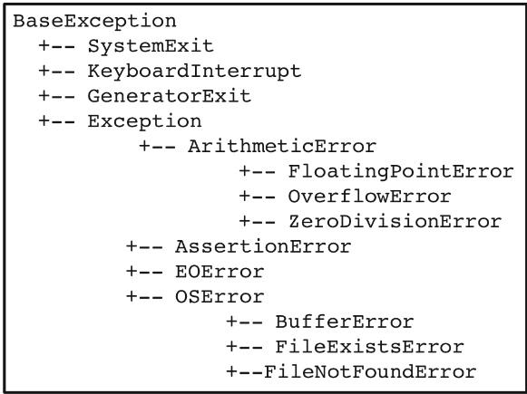

# Week 2: Data Sources

## Weekly Learning Outcomes

> - Identify different data sources and how they are formatted and encoded (MLO 1)
> - Pull data into a program from different sources (MLO 2)
> - Clean and reformat data into a structure required by your program (MLO 2)

<details><summary><h2>Reading for this Week</h2></summary>

### Core Reading

#### Lesson 1

[Unicode Consortium](www.unicode.org)

[International Standard ISO/IEC 10646](https://www.iso.org/standard/76835.html)

Not much reading this week!

</details>

## Lesson 1: Data Encoding

### Base Conversions

First, let's have a quick look at numerical bases. Typically, in day to day life, we use base 10 mathematics (numbers range from 0 to 9). Computers understand things in binary, however (numbers 1 and 0, representing the states on and off). This means that we need to be able to convert binary to denary (or decimal) and back again so that both we and computers can understand maths.

The number fifteen in base 10 is `15`, while the same in base 2 is `1111`. immediately, we can see that there is an issue of compression and legibility when using binary. To overcome this, we use other bases such as octal (base 8) and hexadecimal (base 16). The number `15` in octal is `17` (1x8 + 7x1) and in hexadecimal is `F` (since the numbers range from 0-9, A-F). This is really useful when looking at larger numbers like 127 for example. In binary, this is `1111111`, `177` in octal and `7F` in hex.

Each place in a number represents a power of the base. Starting from the right, each position is $base^0$, $base^1$, $base^2$, $base^3$ etc. Four places of base 2 can therefore only add to 15, while the same in hexadecimal can add to 65,535 ($16^4$)

A proper conversion method between any two bases can be found at [Maths is Fun](https://www.mathsisfun.com/base-conversion-method.html) and it genuinely is fun to think about. Not so useful to talk about the decimal conversion since computers represent floating points differently to how we do in written practice, but it's a fun exercise when you're not in the context of computing.

### Encoding

Enough about numerical representation. Onto string representation!

How does a computer show us characters on our screens? How does it know from a series of 1s and 0s which character we want? **Character encoding** is your answer here.

#### ASCII

ASCII was one of the first, and simplest ways of representing binary numbers as characters. ASCII (and other encoding methods) is basically a map converting numbers to characters. ASCII uses 7 bits (for a maximum of 128 code points) to represent all English printable characters, as well as spaces, special characters and newline markers like `\n`. This character map can be found ubiquitously [online](https://www.ascii-code.com) (this site includes the extended ASCII set, which uses 8 bits).

#### Unicode

ASCII isn't all-encompassing (the A stands for American after all) so how do people living in countries with other character sets (particularly Chinese and related languages) write with a computer? Enter Unicode

Unicode is a character encoding that operates using 4 (actually 6) bytes of hexadecimal to convert numbers to characters. This far extends the ASCII character set to a maxmimum of 1,114,112. This gargantuan number is broken down into 17 'planes', each of $16^4$ available code spaces. Of these 1,114,112, about 800,000 remain unallocated. However, it is useful that we have these 17 different planes to separate math symbols from Latin and those from Sino-Tibetan characters.

Unicode isn't itself an encoding system, but a family of encodings. UTF-8, -16 and -32 (Unicode Transformation Formats) are the actual encodings used to map numbers to a character. UTF-8 is the most popular. It is a variable-length encoding format that can represent Unicode characters with a minimum of 1 byte (8-bits). This means really space-efficient access to the extended ASCII set of 255 characters, with extensibility to more characters by using more bytes. UTF-16 is the equivalent, but with a minimum of 2 bytes, which is good for getting to code points higher than the extended ASCII (limited practical use, really, but is often used in operating systems). UTF-32 is a fixed-width format that uses all 4 bytes, regardless of which characters are used. This is great for systems where fixed memory allocation is important, but isn't really that popular anyway.

UTF-8 is the most popular encoding format on the Internet, and is the standard for file formats like XML and HTML. Python also uses UTF-8 by default

## Lesson 2: File Formats

In this lesson, we talk about different file formats, particularly `.csv`, `.xml` and `.json`.

### Structured vs. Unstructured Formats

When we talk about file formats, they can fit into either structured (or semi-structured) and unstructured formats. There are fewer unstructured formats, but these consist primarily of text, with little to no metadata about the contents of the file. Structure is introduced to a file format when information about how the document is laid out (style) or objects within the document are labelled (markup).

### Comma-Separated Values `.csv`

CSV files are very simple structured files that work by using a delimiter to separate items. Typically, that delimiter is a comma (hence the name), but it can realistically be anything. This format can be easily manipulated using tools in vanilla Python, as well as with packages like Pandas.

```python
# With built in module csv
import csv
with open("mycsv.csv") as csvfile:
    reader = csv.reader(csvfile, delimiter=',')

# Or in Pandas
import pandas as pd
data = pd.read_csv("mycsv.csv")
```

### eXtensible Markup Language `.xml`

XML was developed in the 1970s as a way of adding meaning and structure to otherwise unstructured data. Data is given metadata using tags and other information within those tags. Many believe it to be overly complex, but it has given rise to some important technologies like HTML and modern Microsoft file types (like `.docx`, `.xlsx` and `.pptx`).

We see XML tags most commonly in HTML files, but they originally have a bit of a more arbitrary semantic as in, you can name a tag with anything, like `<game name>` or `<heres a tag name>` rather than the shorter `<body>` or `<html>` tags.

Honestly, I don't like XML, it's ugly and it's why I write the least amount of HTML I can if I ever do anything with web development.

### JavaScript Object Notation `.json`

This is a much nicer file format for giving metadata to data. It works almost exactly like a dictionary and, in fairness, so could XML if you format it the right way, but still. It's structured like a dictionary. It was originally developed as a lightweight transfer file for asynchronous web technologies, but has found further use outside of JavaScript in languages like Python.

Here's an example:

```json
"personal details": {
    "name": "Ross Spectre",
    "age": 24,
    "height": 1.81
}
```

Beautiful. Mwah. Objects can contain strings, integers, real, and list objects

### YAML Ain't Markup Language `.yaml`

This language is similar to JSON, but a little different in that it uses indentation to introduce structures to the language. I'm kinda bored so I'm not gonna talk much more about it. Specification can be found [here](https://yaml.org/spec/1.2.2/#21-collections)

There's some activity stuff where I make some XML and JSON files so have a look at them I guess :)

## Lesson 3: File I/O

Files are how we store things in computers. This is a relatively simple concept but I'll go over some principles

### Relative and Absolute Paths

Because a file directory is structured like a tree, in order to get to a specific location, we must traverse the tree along a specific *path*. If you look at your file directory, you'll see the path at the top in a search bar, typically prettified with '>' characters. In practice, however, folders are separated by either `/` or `\` depending on the operating system.

The path from the root of the directory to the target folder or file is called the *absolute path*. Say I want to get to a folder called "Advanced Programming", I might traverse the following absolute path to get there:

```shell
'C:\RossSpectre\Documents\Advanced Programming'
```

In contrast, the path from any given folder to another folder or file is given as the *relative path*. Let's say our current directory is set to

```shell
'C:\RossSpectre\Documents\University Work\DMTA'
```

and we want to get to

```shell
'C:\RossSpectre\Documents\Advanced Programming'
```

the relative path would be:

```shell
'..\..\Advanced Programming'
```

Where the `..` indicates 'up one level'.

### Reading a File in Python

This is another really simple matter. Python comes with a file opening method `open()` that allows a user to read from or write to a file.

> New function `open()`!
>
> ```python
> open(file, mode, buffering, encoding,
>           errors, newline, closefd, opener):
> ```
>
> Use with a `with` resource manager to ensure file is closed properly after use

| Mode Flags |                       Meaning                       |
|:---------------:|:---------------------------------------------------:|
|       'r'       | Read Mode (Default)                                 |
|       'w'       | Write Mode                                          |
|       'x'       | Write if file doesn't exist<br>(Exclusive Creation) |
|       'a'       | Append to file                                      |
|       '+'       | Read and Write                                      |
|       'b'       | Binary (combine with others)                        |
|       't'       | Text (Default, combine with others)                  |

When reading a file, it is important to remember the position of your file pointer. This is a place in memory that tells the program where in the file you are. If you make multiple calls to read the file (with `file.read()`), each successive call will start where the pointer was last. If you reach the end of the file and try reading again, you'll read nothing.

A file is an iterator, meaning it can be passed to a for loop and be iterated over, line by line (the `newline` parameter of the call to `open` can be changed to decide where that iterator makes the cut).

### Writing to a File in Python

Very similarly, using the `open()` function, we can write to a file. This is where things get more complicated, however.

When writing to a file, we open it in write mode, and simply pass what data we want to write to the file using `file.write()`. The thing about this is that, once you've closed the file, it overwrites the previous contents of that file if there were any to begin with.

If we have the file `alphabet.txt` containing the alphabet a-z, and we write "Hello World!" to it as follows:

```python
with open('alphabet.txt', 'w') as file:
    file.write('Hello World!')
```

Then the alphabet is completely overwritten.

Other flags like "a" and "x" are designed as alternatives. "a" will append whatever you pass to the call to write to the end of the file, like string concatenation, while "x" will prevent any writing to the file if it already exists, preventing any overwriting.

## Lesson 4: Exception Handling

This is a neat one! When you come across errors in Python (or any language really), the program will notify you by raising an error, which is a kind of event or interrupt that is detected by the system. If unhandled, this will result in the program terminating early. This can be pretty disastrous in some programs, especially if your program is safety critical and/or runs round the clock like on a server. So we need to have a way of detecting that event/interrupt and handling it.

### Exceptions in Python

Just like all objects are derived from the `object` class, all Exceptions and Errors are derived from the `BaseException` object. Have a look at this inheritance hierarchy to show this concept



Python has a specific code block that captures exception events so that they don't crash whatever system we're building

### `try ... except`

This code block allows us to introduce some custom functionality when we come across an exception, and prevent the program from failing. Here's a quick example of how to use it:

```python
try:
    # Will throw an error if anything 
    # other than an int is provided
    u_in = int(input("Enter a number: "))
except ValueError as e:
    # Prints the error message, followed
    # by "Please try again"
    print(e + "\nPlease try again")
```

When casting between incompatible data types in Python, a `ValueError` is raised. Interestingly, with Python, we can also intentionally raise an error or exception using the `raise` keyword followed by an exception object.

There are also `else` and `finally` blocks that can be appended to the end of the `try ... except` block. `else` is used to provide code if an error has not occurred, and `finally` is used for any code that has to be run regardless of an error occurring:

```python
try:
    u_in = int(input("Enter a number: "))
except ValueError:
    print("Uh oh! That's no good!")
else:
    # No ValueError thrown
    print("This is fine!")
finally:
    # Will run regardless of error being found
    print("Thanks for your input")
```

### Assertion

This is a really useful keyword for testing. The `assert` keyword essentially says "The following statement will be true" and throws an `AssertionError` if that's not the case.

When writing test cases, Python modules for testing systems will catch `AssertionError`s when run.

## Lesson 5: Regular Expressions (ugh)

Regular expressions! Lovely jargon-filled strings that get things kinda complicated when you don't know what you're doing, and also really not that simple even if you do know what you're doing.

Regular expressions are used for identifying patterns within strings. These patterns are essentially generalisations of what you'll find in text and they can be of any real format that you choose.

### The Python `re` Module for Regex

This module is the main interface you'll ever have with regular expressions (though many packages like `pandas` make use of regex as well). It provides classes and methods for carrying out regular expression manipulation on strings

| Function   | Description                                                                                                  | Returns                     |
|:------------:|--------------------------------------------------------------------------------------------------------------|-----------------------------|
| `findall()`| Returns a list of all matching strings                                                                       | `list[]`                    |
| `search()` | Returns a Match object if there is a match within the string                                                 | `Match object`              |
| `split()`  | Returns a list of strings resulting from being split by the pattern (pattern matches are lost)               | `list[]`                    |
| `sub()`    | Substitutes 1 to many matches with the given string                                                          | `string`                    |
| `match()`  | Returns a match object if zero or more characters at the beginning of the string match the pattern, else `None` | `Match object`              |
| `compile()`| Takes a regular expression and compiles it into a regular expression object                                  | `Regular Expression Object` |

Here's a cheatsheet adapted from [Cheatography](https://cheatography.com/davechild/cheat-sheets/regular-expressions/)

#### Anchors

| Symbol | Description                                                   |
|--------|---------------------------------------------------------------|
| `^`    | Start of string, or start of line in multi-line pattern       |
| `\A`   | Start of string                                              |
| `$`    | End of string, or end of line in multi-line pattern          |
| `\Z`   | End of string                                                |
| `\b`   | Word boundary                                                |
| `\B`   | Not word boundary                                            |
| `\&lt;`| Start of word                                                |
| `\&gt;`| End of word                                                  |

#### Character Classes

| Symbol | Description               |
|--------|---------------------------|
| `\c`   | Control character         |
| `\s`   | White space               |
| `\S`   | Not white space           |
| `\d`   | Digit                     |
| `\D`   | Not digit                 |
| `\w`   | Word                      |
| `\W`   | Not word                  |
| `\x`   | Hexadecimal digit         |
| `\O`   | Octal digit               |

#### Assertions

| Symbol | Description                    |
|--------|--------------------------------|
| `?=`   | Lookahead assertion            |
| `?!`   | Negative lookahead             |
| `?<=`  | Lookbehind assertion           |
| `?!=` or `?<`| Negative lookbehind        |
| `?>`   | Once-only Subexpression        |
| `?()`  | Condition [if then]            |
| `?()\|` | Condition [if then else]      |
| `?#`   | Comment                        |

#### Quantifiers

| Symbol | Description | Symbol (Range) | Description (Range) |
|--------|-------------|-----------------|---------------------|
| `*`    | 0 or more   | `{3}`           | Exactly 3           |
| `+`    | 1 or more   | `{3,}`          | 3 or more           |
| `?`    | 0 or 1      | `{3,5}`         | 3, 4, or 5          |

Add a ? to make it ungreedy

#### Groups and Ranges

| Symbol   | Description                             |
|----------|-----------------------------------------|
| `.`      | Any character except new line (`\n`)<br>also called a wildcard    |
| `(a\|b)` | a or b                                  |
| `(...)`  | Group                                   |
| `(?:...)`| Passive (non-capturing) group           |
| `[abc]`  | Range (a or b or c)                     |
| `[^abc]` | Not (a or b or c)                       |
| `[a-q]`  | Lower case letter from a to q           |
| `[A-Q]`  | Upper case letter from A to Q           |
| `[0-7]`  | Digit from 0 to 7                       |
| `\x`     | Group/sub-pattern number "x"            |

### Escaping Escape Characters

Lots of the things in the tables above use the escape character `\` to become useful, but how can we search for the escape characters in an actual string? Let's say we're searching for the literal string `'\s'`. We need to escape the escape character by using another `\` in the regex pattern to give us `'\\s'`. If we have a lot of escape characters to look for in a string literal, it can become difficult to look at. So an alternative solution is to use *raw strings*. Python strings will automatically register `\` as an escape character, but raw strings will ignore them, allowing us to pass it to the regex pattern without it being escaped: `r'\s'`
