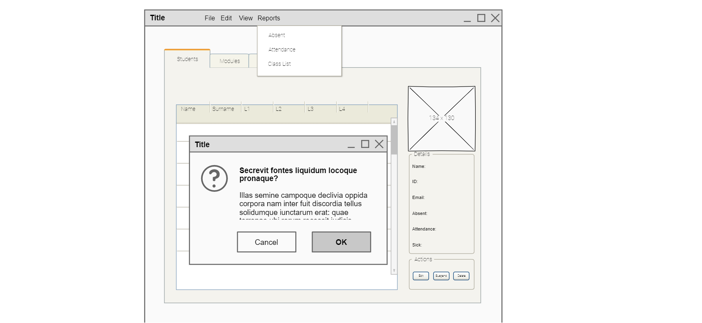
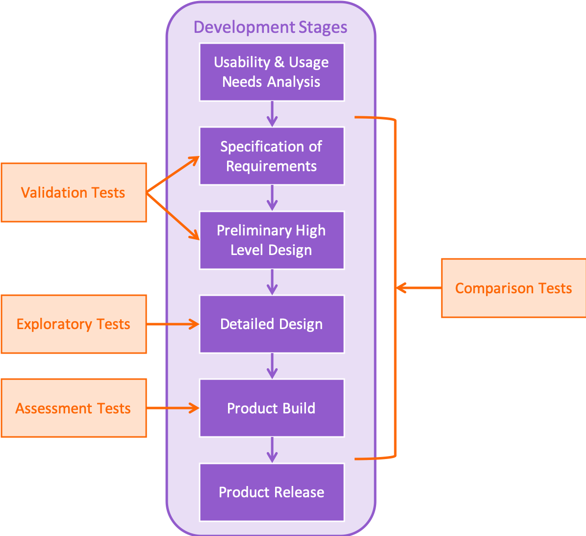

# Week 3: Event-Driven Programming and GUIs

## Weekly Learning Outcomes

> - Articulate the differences and considerations required to develop event-driven programs (MLO 1)
> - Demonstrate how closures and lambda expressions are used in Python (MLO 2)
> - Utilise state diagrams to model interactions and explore approaches to event-driven design (MLO 3)
> - Demonstrate the application of event-driven programming through the construction of GUIs in Python (MLO 2)
> - Utilise a range of GUI components to design and construct effective interfaces (MLO 1)

<details><summary><h2>Reading for this Week</h2></summary>

### Core Reading

#### Lesson 2

Chapter 5 - pp. 85-106

Seidl M., Scholz M., Huemer C., Kappel G. (2015) The State Machine Diagram. In: UML @ Classroom. Undergraduate Topics in Computer Science. Springer, Cham.

Chapter 8

Pilone, D and Pitman, N. (2005) UML 2.0 in a Nutshell. O’Reilly.

[UML specification documentation](https://www.omg.org/spec/UML/2.4/About-UML/#documents)

### Optional Reading

#### Lesson 1

Chapter 14- pp 642-643

Sebesta, R. W. (2016) Concepts of programming languages. Boston: Pearson

Chapter 6 - pp 145-161

Lee K. D. (2014) Python Programming Fundamentals. 2nd Ed. Undergraduate Topics in Computer Science. Springer, Cham

</details>

## Lesson 1: Event-Driven Programming

Event-Driven Programming is a paradigm that forms the basis of a lot of different applications. It allows a computer to react to different occurrences (events) with custom functionality (callback functions).

The operating system runs based on events, using the CPU clock to time events. In all cases of event driven programming, an event loop is used to listen for events.

The event loop is used by an event handler to listen for events, and call a callback function to provide functionality in response.

### Determinism and Event-Driven Programming

In sequential programming, it is entirely possible, no matter how complex your loops and branches, to step through the whole program and map out every eventuality. The same cannot be said for event-driven programming because any type of event can occur at any given moment, regardless of what occurred in the program before that.

However, we can instead model the *state* of a system, or at least how we expect it to look, given responses to certain events. For example, we can say "When we receive X event signal, this object will enter Y state" as opposed to "If X, do Y"

## Lesson 2: Formal Tools

When it comes to visualising the states of objects in a system, it helps to have the right tools for the job. In the case of anything that uses UML (Unified Modelling Language), diagrams can be produced with many different tools like LucidChart, Visual Paradigm, and StarUML.

[In the past](https://willspencer171.github.io/linktree-mimic/portfolios.html) (software engineering module), I've used Visual Paradigm to create UML diagrams, which has been really helpful tbf.

### State Machine Diagrams

Derived from [Harel (1987)](https://www.sciencedirect.com/science/article/pii/0167642387900359), using concepts of finite automata, state machine diagrams tell us diagrammatically how an object can transition from one state to another.

All state machine have 2 fixed components, an initial state and an end state (which I feel is a bit *not the point* of it not being sequential). There are other components that I'll put in this table:

| **Symbol**                     | **Name**                 | **Description**                                                                                     |
|:--------------------------------:|--------------------------|-----------------------------------------------------------------------------------------------------|
| ●                              | Initial State            | The starting point of the state machine. Represented as a filled black circle.                     |
| ○                              | Final State              | The end of the state machine's execution. Represented as a circle with a black dot inside.          |
| Rounded Rectangle              | State                   | Represents a state of the object. Contains the name of the state and optional internal actions.     |
| -->                            | Transition              | Indicates movement from one state to another. Often labeled with an event or condition.            |
| [Condition]                    | Guard Condition         | A boolean expression that must be true for a transition to occur.                                  |
| «entry»/«exit»/«do»            | State Activities        | Specifies actions when entering, exiting, or staying in a state.                                   |
| Hollow Diamond                 | Choice Node             | Represents a decision point with multiple possible transitions based on conditions.                |
| Filled Circle with a Border    | Junction Node           | Combines multiple transitions into one or splits one transition into many.                         |
| Parallel Bars                  | Fork/Join Nodes         | Used to model parallel state transitions or synchronization of states.                             |

So that's nice. Thank you ChatGPT for the table, it's lovely

### State Machine to Python Code

But how does this translate to Python code? The state of an object can be tracked using a simple `state` attribute; things get more complicated when you have to consider transitions between states based on different conditions and signals. Luckily, someone made a package for handling transitions between states that treats objects as state machines - [`transitions`](https://pypi.org/project/transitions/) package.

## Lesson 3: Closures and Lambdas

When it comes to event-driven programming, there are two concepts that are useful to think about: closures and anonymous functions (lambdas)

### Closures

Put simply:

>In Python, a closure is a function that retains access to the variables in its enclosing lexical scope even after the scope has finished executing. This is achieved by capturing the local variables of the outer function when the inner function is defined.
>
>Closures are created when:
>
> 1. A nested function references variables from its enclosing scope.
> 2. The enclosing function returns the nested function.

This means that, if we have a function that defines, then returns another function, the returned (inner) function is a closure.

For example:

```python
def multiplier(x):
    def by(y):
        return x * y
    return by

doubler = multiplier(2)
tripler = multiplier(3)

doubler(4)
# >>> 8

tripler(9)
# >>> 27
```

If you want to *modify* a variable from inside the scope of the enclosing function, you can access it using `nonlocal` in the closure:

```python
def sum_two(num1, num2):
    total = num1 + num2
    def increment_5():
        nonlocal total
        total += 5
        return total
    return increment_5

add = sum_two(2, 4)
add()
# >>> 11
```

You can also find out if a function is a closure (i.e. it comes from inside another function) by accessing its `__closure__` property.

What's also interesting about closures is that, once they are assigned to a variable, the outer function can be `del`eted and the closure would still be accessible, thus making the functionality of the outer function accessible by proxy.

### Anonymous Functions (Lambdas)

Functions don't always have to be given a name in the namespace. Sometimes we need to just create some temporary functionality that we won't be referring to another time. OR we might be referring to it another time, but want to store this functionality inside another data structure like a list or dictionary, rather than a variable.

Enter lambdas.

In Python we can create an anonymous function using the `lambda` keyword, passing a temporary variable name as a parameter:

```python
def calculate_price(price):
    return lambda qty: price * 1.2 * qty

calc = calculate_price(1)
qty_10 = calc(10)
# >>> 12

qty_20 = calc(20)
# >>> 24
```

The anonymous lambda function is technically also a closure since it has access to the local variables in the outer function and is returned by that outer function.

What's particularly useful about this is that we can generate functions and store them in another structure and access them through that:

```python
my_funs = []

for i in range(1, 9):
    my_funs.append(calculate_price(i))

qty = 5
price = 7
print(f'{qty} items at £{price} costs £{my_funs[price-1](qty)}')
# >>> 5 items at £7 costs £42
```

So that's neat

## Lesson 4: Graphical User Interfaces (GUIs)

Not really so much of a lesson as it is a research activity. There are a few resources they suggets we have a look at:

- [Foundation for Interaction Design](https://www.interaction-design.org/literature)
- [W3C: Web Content Accessibility Guidelines](https://www.w3.org/TR/WCAG20/)
- [Digital.gov for best practices](https://www.usability.gov/)
- [UX Design Resources and Guidelines](https://bpb-eu-w2.wpmucdn.com/sites.aub.edu.lb/dist/c/13/files/2019/06/the-basics-of-ux-design.pdf)

### Foundation for Interaction Design

This is a huge book - over 4000 pages of textbooks. It's a compendium comprising 44 textbooks from leaders in User Interface/Experience design. Seems like it would be good, if it weren't so damn large :'(

### W3C: Web Content Accessibility Guidelines

Ironically, the website for this looks horrible and terribly outdated (very 2008). However, this is a good guideline for making sure user interfaces are accessible both to the disabled and the able-bodied.

There are 4 fundamental concepts:

1. Perceivability
2. Operability
3. Understandability
4. Robustness

This acts as a list of problems that could come up in terms of accessibility and has a remedy for just about any of them :)

For example, under operability, making sure the entire application is keyboard accessible is important (at least IMO), because some people don't have mouse controls, or have limitations that prevent use of a mouse. Also, keyboard shortcuts for functions is really helpful in terms of efficiency (imagine not having a keyboard shortcut for getting to the VS Code command pallette `Ctrl-Shift P`).

### Digital.gov

There's a bunch of resources on here from seminars or llinks to other resources like [18F](https://guides.18f.gov/methods/) which seems to have a step-by-step paradigm for usability testing and creating things for the sake of usability.

Those 4 stages are:

- Discovery
- Decision
- Making
- Validation

Each stage has a series of methods involved that map out the path of design research and lead to a more usable interface for the target user base.

This digital.gov website also has a link to the [Department of Homeland Security's](https://www.dhs.gov/cx/resources/guides-kits/dhs-usability-testing-kit) approach to usability testing

### UX Design Resources and Guidelines

This is a book as well, by the same people who did the first resource (Interaction Design Foundation). This seems to be a useful resource if you have the time and effort to read a whole 70-page textbook, which I have neither of. However, there is a bit of useful information I found on a scan of the contents page - the 7 factors that affect user experience:

Is your application

1. Useful?
2. Usable?
3. Findable?
4. Credible?
5. Desirable?
6. Accessible?
7. Valuable?

### Interface Components

Well, surely we all know what makes up an interface, we interact with them all the time! But for reference, here's a few components of the interface that we need to know about:

| **UI Element**    | **Description**                                                      |
|:--------------------:|----------------------------------------------------------------------|
| Label             | Adding text                                                         |
| Button            | Something to click                                                  |
| Text Box          | Somewhere to input text                                             |
| Radio Button      | To select one from many                                             |
| Check Box         | To select something                                                 |
| Table             | To present or enter information                                     |
| Scroll Bar        | To move across/down information presented in a contained space      |
| Menu Bar          | To provide functionality                                            |
| Tabs              | To move between views within the same window                        |
| Dropdown Menu        | A list of options that expands when clicked for users to select one. |
| Tooltip              | A small popup that provides additional information when hovering over an element. |
| Progress Bar         | Indicates the progress of a task, such as loading or file upload.  |
| Carousel/Slider      | A rotating display of images or content, often used for galleries. |
| Date Picker          | A UI element for selecting dates from a calendar-like interface.   |

There are a few good bits of software out there for designing interface mockups and wireframes. The ones they suggest in this course are Pencil and LucidChart (again). I'm working with Pencil purely because it's downloadable software, but the better option is likely LucidChart anyway?



### Basic Design Principles

Wow, lots to look into for this week's content, what a shame I'm a week behind, almost.

There are 7 basic design principles that we need to adhere to:

1. Proximity
2. Similarity
3. Continuity
4. Closure
5. Symmetry
6. Figure
7. Common Fate

These design principles are kind of intuitive in their names, but I'll have a table here as well (again, everyone say thank you ChatGPT):

| **Principle**          | **Description**                                                                                     |
|-------------------------|-----------------------------------------------------------------------------------------------------|
| Proximity              | Elements that are close to each other are perceived as a group.                                     |
| Similarity             | Elements that are similar in shape, color, size, or texture are perceived as related or grouped.    |
| Continuity             | The human eye follows a path or curve, creating a sense of flow between elements.                   |
| Closure                | The mind completes incomplete shapes to perceive them as whole objects.                             |
| Figure-Ground          | Elements are perceived as either the focus (figure) or the background (ground).                     |
| Symmetry and Order     | The mind perceives symmetrical and orderly arrangements as stable and harmonious.                   |
| Common Fate            | Elements that move in the same direction or at the same speed are perceived as part of a group.     |

### Colour Theory

Colour theory is a really important aspect of design. The University has a good presentation about it that I've got available [here](Wk3_Colour.pdf) and I think it's definitely worth looking through.

Some other tools exist that help with selecting colours and colour pallettes that work well together in terms of colour theory, including [Paletton](https://paletton.com/#uid=1000u0kllllaFw0g0qFqFg0w0aF).

Have a look at this book also:

[Marcus A. (2015) Patterns Within Patterns. In: HCI and User-Experience Design. Human–Computer Interaction Series. Springer, London pp. Pages 101-107](https://link-springer-com.libproxy.york.ac.uk/book/10.1007/978-1-4471-6744-0)

Textbook whose 13th chapter is all about pattern recognition in HCI (Human-Computer Interface) design. Quite interesting.

### User Testing your UI/X

When it comes to finding out what's best for your application, nothing beats getting stakeholder feedback. Produce a testable prototype of your application and get them to tell you how they feel about it. How it runs, how it looks, whether it works like they'd expect it to. This is a good scheme to follow:



## Lesson 5: GUIs in Python - Tkinter

I haven't really used this in years, but I remember in year 10 when we were learning about Python, we used Tkinter and it was the most confusing thing because I didn't know anything about OOP. And event-driven programming is seriously OOP.

[TKinter](https://docs.python.org/3/library/tkinter.html) is a built-in GUI engine that comes with Python and is a wrapper for Tcl/Tk (Tool Command Language/ToolKit - pronounced "tickle"), which is a scripting language used to build GUIs from native widgets. There are also two packages available within Tkinter: [`Tkinter.tix`](https://docs.python.org/3.5/library/tkinter.tix.html?highlight=tkinter%20tix) (extra widgets not included in base Tkinter, deprecated in 3.6) and [`Tkinter.ttk`](https://docs.python.org/3/library/tkinter.ttk.html#module-tkinter.ttk) (themed widgets that set attributes in a slightly different way to standard Tkinter :))
